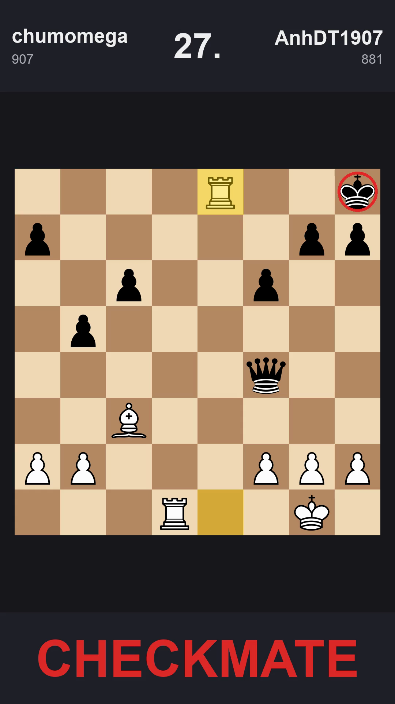

# tempo

Turn a chess PGN into a vertical 9:16 MP4 short. Plays a gunshot SFX every
time a piece moves to a square from which it attacks an enemy piece. Soft
click on quiet moves. Designed to drop into CapCut for voiceover and pacing.


<!-- if you want a hero image, render the sample game and copy the
     CHECKMATE frame to docs/preview.png. -->

## What you get

- 1080x1920, H.264 + AAC
- 1 second per half-move (configurable)
- Header: white name + Elo on the left, black on the right, move number
  centered
- Yellow tint on the from/to squares of the last move
- Red ring around enemy pieces under attack from the moved piece
- Gunshot on attacking moves; gunshot + reverb tail on mate
- "CHECKMATE" frame in red on the final move

## Install

You need `ffmpeg` and Python 3.11+.

```bash
brew install ffmpeg
git clone git@github.com:chumomega/tempo.git
cd tempo
python3 -m venv .venv
source .venv/bin/activate
pip install -r requirements.txt
```

The first run downloads the gunshot SFX from YouTube via `yt-dlp` and caches
it at `assets/gunshot.wav`. If YouTube is throttling, drop your own WAV at
that path and re-run.

## Use

```bash
# Default: read game.pgn, write out/chess_short.mp4 at 1s per half-move.
python -m tempo.pgn_to_short game.pgn
```

Flags:

| flag | what it does |
| --- | --- |
| `--seconds-per-move 1.5` | render at a different pace |
| `--start-from 13` | only render from full-move 13 onward |
| `--no-click` | drop the soft click on quiet moves |
| `--keep-frames` | keep the per-ply PNGs and the audio track |
| `--out path/to/out.mp4` | override output path |

The CLI prints a per-ply log so you can spot-check trigger logic:

```
ply  25  13. Re1+        ATTACK   attacks=['e8']
ply  51  26. Qxe8+       ATTACK   attacks=['c6', 'a8', 'h8']
ply  53  27. Rxe8#       MATE     attacks=['h8']
```

## How it works

```
PGN ──► engine ──► [PlyState, ...] ──► render ──► PNG frames
                                  └──► audio  ──► WAV mix
                                                    │
                                          ffmpeg mux ▼
                                          out/chess_short.mp4
```

- `tempo/engine.py` parses the PGN with `python-chess` and, for each ply,
  records SAN, from/to squares, and which enemy pieces the moving piece
  attacks from its destination. Pawns count diagonally only.
- `tempo/render.py` rasterizes the board (SVG → PNG via `cairosvg`) and
  composites a 1080x1920 frame with the header, highlights, attack rings,
  and footer SAN.
- `tempo/audio.py` pulls the gunshot, trims to a punchy 0.6s with
  `silenceremove` + `loudnorm`, then builds the timeline by feeding
  ffmpeg N copies of the SFX with per-event `adelay`, mixed with `amix`.
- `tempo/pgn_to_short.py` is the CLI; ffmpeg stitches frames at 1 fps,
  outputs at 30 fps so platforms accept it, and muxes in the audio.

For deeper architecture notes, see [CLAUDE.md](CLAUDE.md).

## Tests

```bash
pytest tests/
```

The included tests verify attack detection on three positions in the sample
game (`Re1+`, `Qxe8+`, `Rxe8#`).

## Contributing

- Open an issue first for anything beyond a small fix; the project is
  intentionally small and opinionated.
- Style: standard library + the dependencies in `requirements.txt`. Don't
  add a framework. Keep modules under ~200 lines where reasonable.
- Run `pytest tests/` before pushing. If you change attack detection,
  `tempo/engine.py`, or the sample game, update `tests/test_engine.py`
  to match.
- Keep commits scoped: one logical change per commit, present-tense
  imperative subject lines (`feat(render): ...`, `fix(audio): ...`).
- The pipeline is end-to-end testable in ~20 seconds on the sample PGN.
  Render with `--keep-frames` and inspect `frames/` if a visual change
  isn't doing what you expect.

Easy starting points if you want to contribute:

- A `--theme` flag for board colors (lichess blue, chess.com green, etc.)
- Pawn promotion glyph in the footer (`e8=Q+`)
- Configurable piece sets (`--pieces cburnett` vs `merida`)
- A `--from-fen` mode for puzzles that don't start from the initial position
- Better fallback when YouTube blocks (fetch from freesound.org)

## License

MIT — see [LICENSE](LICENSE) if present, otherwise treat as MIT.
